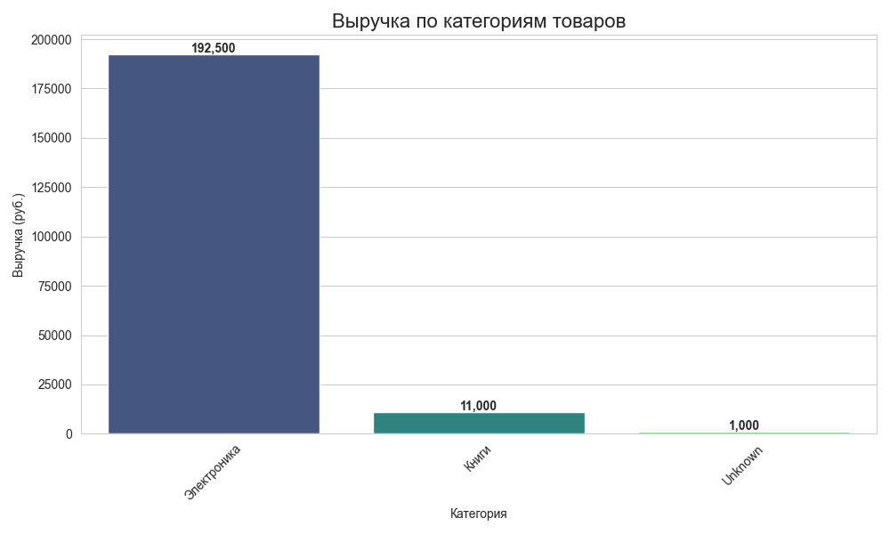
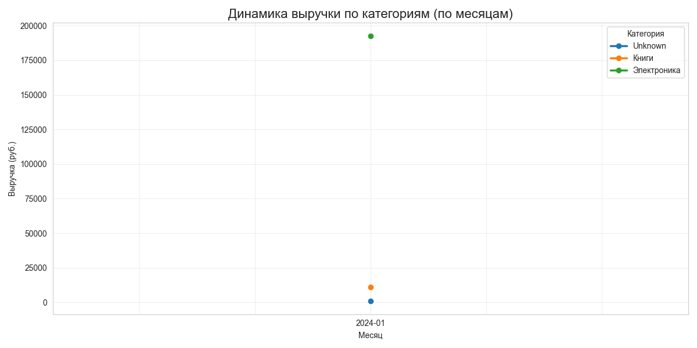
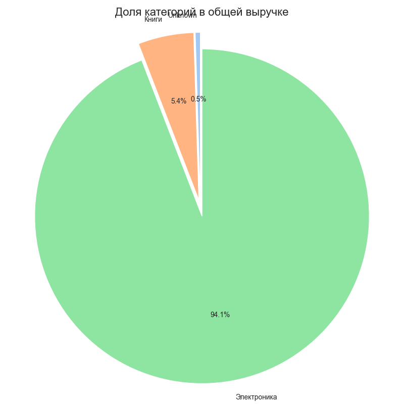

# Отчет по лабораторной работе №15: Простой ETL-пайплайн на Python, Apache Kafka

## Сведения о студенте  
**Дата:** 2026-05-14 
**Семестр:** 2 курс, 2 семестр  
**Группа:** Пин-б-о-24-1  
**Дисциплина:** Технологии программирования  
**Студент:** Куйбышев Александр Максимович

## Цель работы
**Часть 1:**
    Получить практические навыки построения ETL-пайплайна: извлечение данных из CSV, очистка и преобразование данных, агрегация, загрузка в базу данных SQLite и базовая визуализация результатов.

**Часть 2:**
    Получить практические навыки работы с Apache Kafka: запуск кластера через Docker Compose, создание топиков, написание продюсера и консюмера для потоковой передачи сообщений, анализ сценариев использования потоковой обработки.

## Часть 1: Простой ETL-пайплайн на Python

### Выполненные задачи
1. Загрузка CSV с автоматическим определением кодировки (`utf-8` / `windows-1251`), обработка ошибок отсутствия файла, вывод статистики.
2. Удаление дубликатов, заполнение пропусков (числовые — медианой, текстовые — `'Unknown'`), фильтрация строк с `quantity <= 0` или `price_per_unit <= 0`, преобразование типов, добавление колонок `total_amount` и `month_year`.
3. Группировка по категории и месяцу с расчётом суммарного количества, выручки, средней цены и количества заказов.
4. Сохранение в SQLite двух таблиц (`sales_cleaned`, `sales_aggregated`) с проверкой через SQL-запрос.
5. Построение столбчатой диаграммы выручки по категориям, линейного графика динамики по месяцам, круговой диаграммы долей категорий.

### Ключевые фрагменты кода

**1. Извлечение с обработкой кодировки**
```py
def extract(self) -> pd.DataFrame:
    try:
        try:
            self.raw_data = pd.read_csv(self.csv_path, encoding='utf-8')
        except UnicodeDecodeError:
            self.raw_data = pd.read_csv(self.csv_path, encoding='windows-1251')
        if self.raw_data.empty:
            raise ValueError("CSV файл пуст")
    except FileNotFoundError:
        logger.error(f"Файл {self.csv_path} не найден")
        raise
    ...
```

**2. Очистка данных**
```py
df[col] = df[col].fillna(median_val)
df[col] = df[col].fillna('Unknown')

df = df[(df['quantity'] > 0) & (df['price_per_unit'] > 0)]

df['total_amount'] = df['quantity'] * df['price_per_unit']
df['month_year'] = df['order_date'].dt.strftime('%Y-%m')
```

**3. Загрузка в SQLite(sqlalchemy)**
```py
from sqlalchemy import create_engine, text
...
self.cleaned_data.to_sql('sales_cleaned', engine, if_exists='replace', index=False)
self.aggregated_data.to_sql('sales_aggregated', engine, if_exists='replace', index=False)
with engine.connect() as conn:
    tables = conn.execute(text("SELECT name FROM sqlite_master WHERE type='table';")).fetchall()
```

**4. Визуализация**
```py
cat_total = self.aggregated_data.groupby('category')['total_revenue'].sum()
plt.pie(cat_total, labels=cat_total.index, autopct='%1.1f%%', ...)
plt.savefig('report/graphs/pie_chart.png')
```

## Результаты выполнения


```bash
2026-05-13 13:32:49,369 - INFO - ==================================================
2026-05-13 13:32:49,369 - INFO - ЗАПУСК ETL ПАЙПЛАЙНА
2026-05-13 13:32:49,370 - INFO - ==================================================
2026-05-13 13:32:49,370 - INFO - ==================================================
2026-05-13 13:32:49,370 - INFO - НАЧАЛО ЭТАПА EXTRACT
2026-05-13 13:32:49,370 - INFO - UTF-8 не подошёл, пробуем windows-1251
2026-05-13 13:32:49,372 - INFO - Загружено 11 строк, 9 колонок
2026-05-13 13:32:49,372 - INFO - Колонки: order_id, order_date, product_name, category, quantity, price_per_unit, customer_name, customer_city, payment_method
2026-05-13 13:32:49,373 - INFO - Типы данных:
order_id          int64
order_date          str
product_name        str
category            str
quantity          int64
price_per_unit    int64
customer_name       str
customer_city       str
payment_method      str
2026-05-13 13:32:49,374 - INFO - Пропуски:
order_id          0
order_date        0
product_name      1
category          1
quantity          0
price_per_unit    0
customer_name     1
customer_city     1
payment_method    0
2026-05-13 13:32:49,375 - INFO - ==================================================
2026-05-13 13:32:49,375 - INFO - НАЧАЛО ЭТАПА TRANSFORM
2026-05-13 13:32:49,377 - INFO - Удалено дубликатов: 1
2026-05-13 13:32:49,378 - INFO - Колонка 'quantity': NaN до обработки 0, медиана 1.00
2026-05-13 13:32:49,378 - INFO - Колонка 'price_per_unit': NaN до обработки 0, медиана 2750.00
2026-05-13 13:32:49,378 - INFO - Колонка 'category': пропусков 1, заменены на 'Unknown'
2026-05-13 13:32:49,379 - INFO - Колонка 'product_name': пропусков 1, заменены на 'Unknown'
2026-05-13 13:32:49,379 - INFO - Колонка 'customer_name': пропусков 1, заменены на 'Unknown'
2026-05-13 13:32:49,381 - INFO - Колонка 'customer_city': пропусков 1, заменены на 'Unknown'
2026-05-13 13:32:49,381 - INFO - Колонка 'payment_method': пропусков 0, заменены на 'Unknown'
2026-05-13 13:32:49,382 - INFO - Удалено строк с аномалиями: 1
2026-05-13 13:32:49,385 - INFO - После очистки: 9 строк (удалено всего 2)
2026-05-13 13:32:49,385 - INFO - Диапазон дат: 2024-01-15 – 2024-01-19
2026-05-13 13:32:49,386 - INFO - ==================================================
2026-05-13 13:32:49,386 - INFO - НАЧАЛО ЭТАПА AGGREGATE
2026-05-13 13:32:49,391 - INFO - Агрегировано 3 групп
2026-05-13 13:32:49,395 - INFO -
      category month_year  total_quantity  total_revenue  avg_price  order_count
0      Unknown    2024-01               1         1000.0    1000.00            1
1        Книги    2024-01               4        11000.0    2833.33            3
2  Электроника    2024-01               8       192500.0   37600.00            5
2026-05-13 13:32:49,395 - INFO - ==================================================
2026-05-13 13:32:49,395 - INFO - НАЧАЛО ЭТАПА LOAD
2026-05-13 13:32:49,638 - INFO - Таблица 'sales_cleaned' сохранена (9 записей)
2026-05-13 13:32:49,877 - INFO - Таблица 'sales_aggregated' сохранена (3 записей)
2026-05-13 13:32:49,878 - INFO - Таблицы в БД: ['sales_cleaned', 'sales_aggregated']
2026-05-13 13:32:49,879 - INFO - Содержимое sales_aggregated:
2026-05-13 13:32:49,881 - INFO - ('Unknown', '2024-01', 1, 1000.0, 1000.0, 1)
2026-05-13 13:32:49,881 - INFO - ('Книги', '2024-01', 4, 11000.0, 2833.33, 3)
2026-05-13 13:32:49,882 - INFO - ('Электроника', '2024-01', 8, 192500.0, 37600.0, 5)
2026-05-13 13:32:49,882 - INFO - Данные загружены в sales.db
2026-05-13 13:32:49,883 - INFO - ==================================================
2026-05-13 13:32:49,884 - INFO - НАЧАЛО ЭТАПА VISUALIZE
C:\Users\Александр\Documents\NCFU\Software_engeneering\lab1500\etl\etl_pipeline.py:152: FutureWarning:

Passing `palette` without assigning `hue` is deprecated and will be removed in v0.14.0. Assign the `x` variable to `hue` and set `legend=False` for the same effect.

  ax = sns.barplot(x=cat_revenue.index, y=cat_revenue.values, palette='viridis')
2026-05-13 13:33:00,635 - INFO - Графики сохранены в graphs_png
2026-05-13 13:33:00,635 - INFO - ==================================================
2026-05-13 13:33:00,639 - INFO - ETL ПАЙПЛАЙН УСПЕШНО ЗАВЕРШЁН
2026-05-13 13:33:00,640 - INFO - ==================================================
```

## Часть 2: Знакомство с Apache Kafka

### Выполненные задачи
1. Настройка Docker Compose (файл `docker-compose.yml`) для запуска Zookeeper, Kafka и Kafka UI.
2. Создание топика `orders` с тремя партициями и фактором репликации 1.
3. Реализация продюсера (`producer.py`), генерирующего события о заказах с ключом по `customer_id` и отправляющего их в Kafka.
4. Реализация базового консюмера (`consumer.py`), читающего сообщения и агрегирующего статистику (общее количество заказов, выручка, средний чек, распределение по категориям и городам, последние 10 заказов).
5. Реализация оконного консюмера (`windowed_consumer.py`), который вычисляет ту же статистику только по заказам, поступившим за последние 60 секунд.
6. Проверка работы через веб-интерфейс Kafka UI и консольные команды.

### Ключевые фрагменты кода

**Подключение `producer.py` и отправка с ключом**
```py
def connect(self):
    self.producer = KafkaProducer(
        bootstrap_servers=self.bootstrap_servers,
        value_serializer=lambda v: json.dumps(v).encode('utf-8'),
        key_serializer=lambda k: k.encode('utf-8') if k else None,
        acks='all',
        retries=3
    )

def send_order(self, order):
    key = str(order['customer']['id'])
    future = self.producer.send(self.topic, key=key, value=order)
    record_metadata = future.get(timeout=10)
```

**Обновление статистики в `consumer.py`**
```py
def update_stats(self, order):
    self.stats['total_orders'] += 1
    self.stats['total_revenue'] += order['total_amount']
    for item in order['items']:
        self.stats['orders_by_category'][item['category']] += 1
    city = order['customer']['city']
    self.stats['orders_by_city'][city] += 1
    self.stats['recent_orders'].append({...})
    if len(self.stats['recent_orders']) > 10:
        self.stats['recent_orders'].pop(0)
```

## Результаты выполнения

Запуск `producer.py` на 15 заказов и одновременная работа `consumer.py`:

```bash
2026-05-13 16:29:34 - INFO - ==================================================
2026-05-13 16:29:34 - INFO - ТЕКУЩАЯ СТАТИСТИКА ЗАКАЗОВ
2026-05-13 16:29:34 - INFO - Всего заказов: 5
2026-05-13 16:29:34 - INFO - Общая выручка: 326,500.00 руб.
2026-05-13 16:29:34 - INFO - Средний чек: 65,300.00 руб.
2026-05-13 16:29:34 - INFO - Заказов по категориям: {'Электроника': 4, 'Книги': 1}
2026-05-13 16:29:34 - INFO - Заказов по городам: {'Москва': 3, 'СПб': 1, 'Казань': 1}
2026-05-13 16:29:34 - INFO - Последние 3 заказа: [{'order_id': 'a1b2c3d4', ...}, ...]
2026-05-13 16:29:34 - INFO - ==================================================
```

Веб-интерфейс Kafka UI показал топик `orders` с тремя партициями и смещениями сообщений. Контейнеры `zookeeper`, `kafka`, `kafka-ui` находились в статусе `Up`

## Выводы
**Часть 1:**
1. Разработанный ETL-пайплайн успешно решает задачу очистки и агрегации данных о продажах
2. При работе с CSV-файлами важно учитывать кодировку
3. Использование явного присваивания обеспечивает корректную работу с современными версиями pandas
4. Агрегация позволила наглядно увидеть распределение выручки по категориям: основную долю занимает «Электроника»
5. Визуализация помогает быстро интерпретировать результаты и выявлять аномалии (например, категорию с неизвестным товаром)

**Часть 2:**
1. Kafka предоставляет надёжную и масштабируемую платформу для потоковой обработки событий с минимальной задержкой
2. Разработанные продюсер и консюмер продемонстрировали простоту интеграции с Kafka на Python, а использование ключей сообщений позволило управлять партиционированием и связанностью данных
3. Потоковая агрегация в памяти работает быстро, но для промышленного применения необходимо использовать внешнее хранилище состояния или Kafka Streams для отказоустойчивости
4. Консюмер со скользящим окном показал возможность расчёта метрик за заданный временной интервал в реальном времени, что полезно для мониторинга и алертинга
5. Сравнение с пакетной ETL подтвердило преимущества потоковой обработки по скорости реакции и возможности горизонтального масштабирования

## Ответы на контрольные вопросы
**Часть 1:**
1. **Какие аномалии и пропуски были обнаружены в исходных данных? Как вы их обработали?**  
   - (строка 1004) пропуск в текстовом поле заменен на `'Unknown'`
   - (заказ 1005) отрицательное количество – строка удалена, так как отрицательные продажи бессмысленны 
   - (заказ  1010) дубликат удалён, чтобы задвоения выручки не случилось 

2. **В чём разница между ETL и ELT? Какой подход для данной задачи?**  
   ETL выполняет трансформацию перед загрузкой в хранилище, а ELT после загрузки. В работе использован ETL, так как данные небольшие и очистка в `pandas` перед загрузкой в SQLite проще

3. **Почему в реальных проектах данные не загружают напрямую в базу без очистки?**  
   Не чистые данные приводят к некорректной аналитике, нарушают ограничения целостности, накапливают ошибки и увеличивают объём хранилища,предварительная очистка поддерживает качество данных

4. **Какие ещё трансформации могли бы быть полезны для этих данных?**  
   Приведение строк к единому регистру, выделение дня недели или квартала из даты, нормализация названий городов, фильтрация выбросов по сумме чека, разделение имени клиента на составляющие и др

**Часть 2:**
1. **Что такое топик, партиция, офсет в Kafka? Как они использовались в работе?**
   Топик - логическая группа сообщений (в `orders`). Партиция - физический сегмент топика для параллельной обработки (создано 3). Офсет - уникальный номер сообщения в партиции (использовался для отслеживания позиции в `consumer.py` и контроля дубликатов)

2. **В чём разница между продюсером и консюмером? Зачем нужна группа консюмеров (`group_id`)?**
   Продюсер публикует сообщения, консюмер подписывается и обрабатывает их. Группа консюмеров гарантирует, что каждое сообщение из партиции будет доставлено только одному экземпляру внутри группы, что позволяет масштабировать обработку и избегать дублирования

3. **Какие преимущества даёт потоковая обработка перед пакетной (ETL из Части 1)?**
   Минимальная задержка, возможность немедленной реакции на события (алерты), горизонтальная масштабируемость за счёт партиций, высокая отказоустойчивость

4. **Приведите 3 реальных сценария использования Kafka в бизнесе (не связанных с логированием).**
   - В интернет-магазинах и на маркетплейсах: Kafka обрабатывает потоки данных о поведении пользователей: клики, просмотры, добавления в корзину, отказы от покупки и другие действия
   - В розничных сетях Kafka интегрирует данные из разных источников: POS-чеки, остатки товаров, ценники и информацию о промоакциях
   - В логистических компаниях и службах доставки Kafka обрабатывает данные о трекерах курьеров, статусах пунктов выдачи заказов (ПВЗ), пробках и окнах доставки клиентов

5. **Что произойдёт, если запустить 2 консюмера с одинаковым `group_id`?**
   2 консюмера с одинаковым `group_id` работают как единая группа: совместно обрабатывают данные из топика, делят между собой партиции и обеспечивают отказоустойчивость за счёт ребалансировки, дублирования обработки внутри группы не произойдёт 

## Приложения
Графики: 
-  
-  
- 